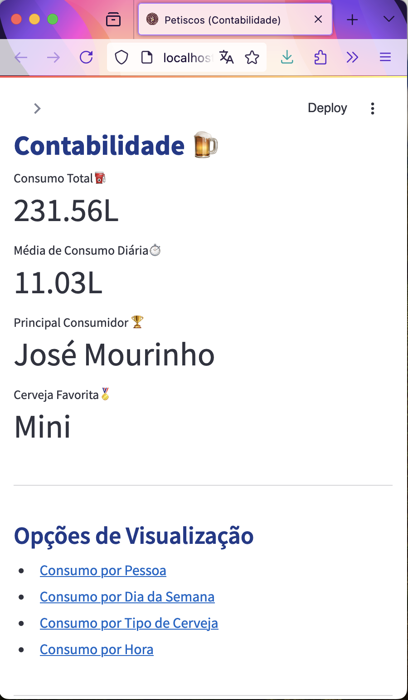
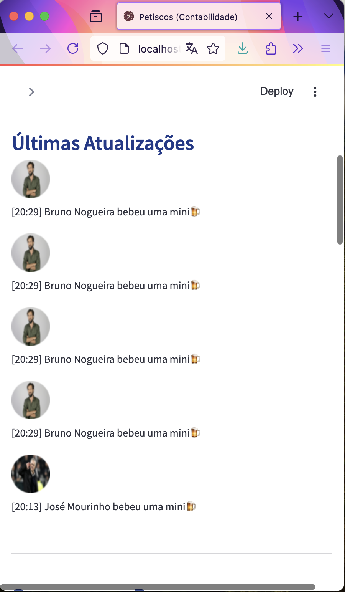
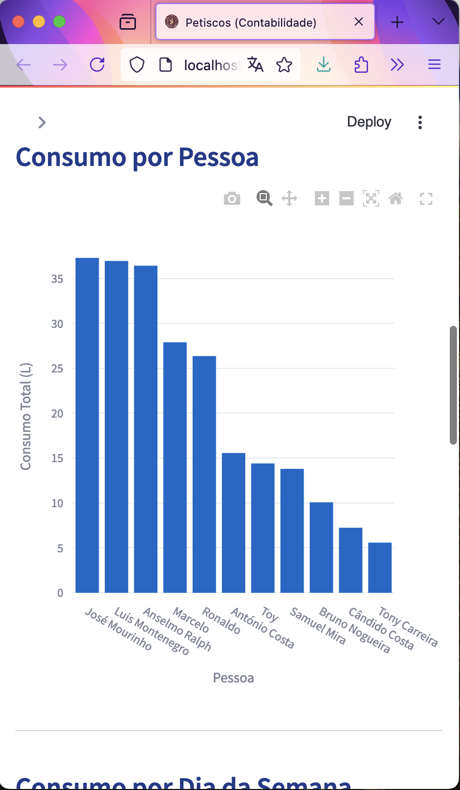
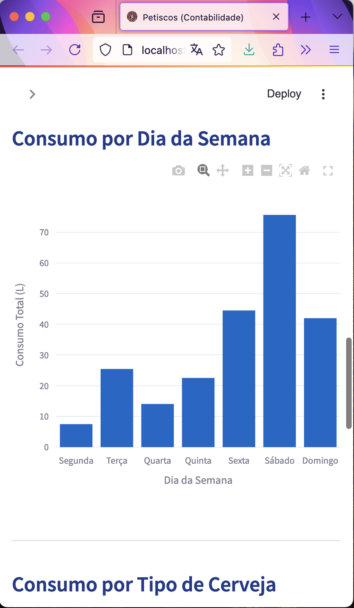
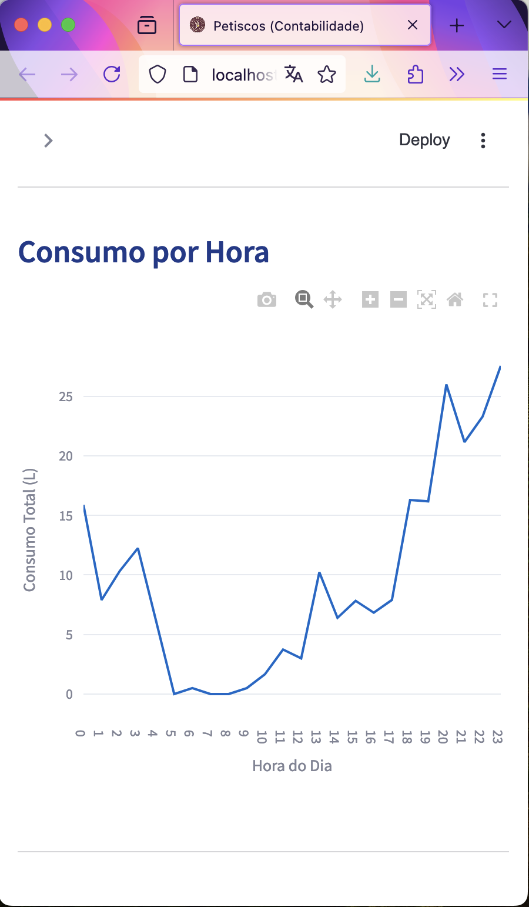
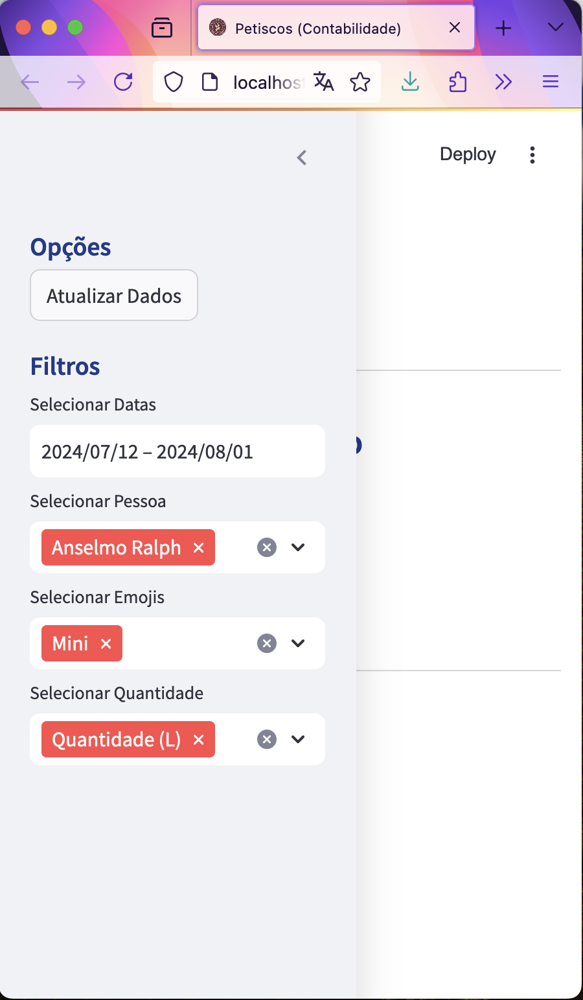

# 🍺 Petiscos Contabilidade:  WhatsApp Beer Tracker 🍻

[](https://my-first-project-yqtsz3s4wq-uc.a.run.app)

This Streamlit web application is your go-to tool for analyzing your group's beer consumption habits! 🍻 It semi-automatically fetches WhatsApp chat data directly from your Google Drive, ensuring your insights are always up-to-date. 

Simply create a WhatsApp group where you and your friends send beer-related emojis 🍺 each time you enjoy a drink. Periodically, one member of the group exports the chat to Google Drive. Using the Google Drive API, the app will sync and update the data, allowing you to explore trends, stats, and fun visualizations on the website. Cheers to effortless beer tracking! 🎉

## ✨ Features

### 📊 Data Analysis & Visualization
* **Real-time updates:** Fetches the latest WhatsApp chat data automatically from Google Drive.
* **Interactive dashboard:**  Filter by date range, person, and beer type.
* **Comprehensive metrics:** Displays total and average consumption, top consumer, and favorite beer.
* **Insightful visualizations:**
    - Bar charts to compare individual and beer-type consumption.
    - Pie chart for consumption distribution by beer type.
    - Line chart to track consumption trends over time.
* **Customizable:** Easily add or change beer types and their associated volumes.

### ☁️ Google Drive Integration
* **Seamless data fetching:** Automatically downloads the most recent WhatsApp chat export from your specified Drive folder.
* **Clean-up:** Keeps your Drive organized by removing older chat files.

## 🛠️ Installation & Setup

1. **Clone Repository:**
   ```bash
   git clone https://github.com/tiagomosantos/BeerDashboardWpp.git
   ``` 

2. **Install dependencies:**
Navigate to the project directory and install the required packages using pip:
   ```bash
   cd BeerDashboardWpp
   pip install -r requirements.txt
   ```

3. **Set up Google Drive API access:**
* Ensure you have a Google Cloud project with Drive API enabled.
* Download your credentials JSON file and place it in the project root `credentials.json`.
* Create a repository for your app.
* Create a service on Cloud Run with constinuouly deployment from a GitHub repository.


## 🖼️ Examples 

* **Main Dashboard**


* **Latest News**


* **Consumption per Person**


* **Consumption per Weekday**


* **Consumption per Hour**


* **Available Filters**
